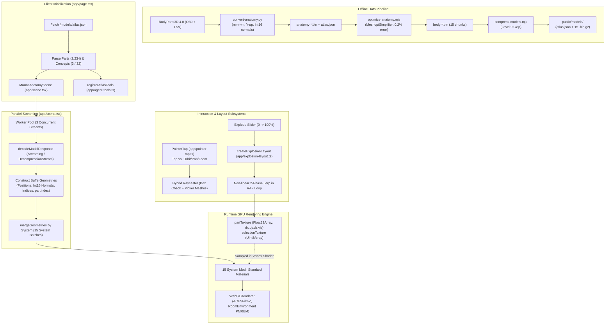
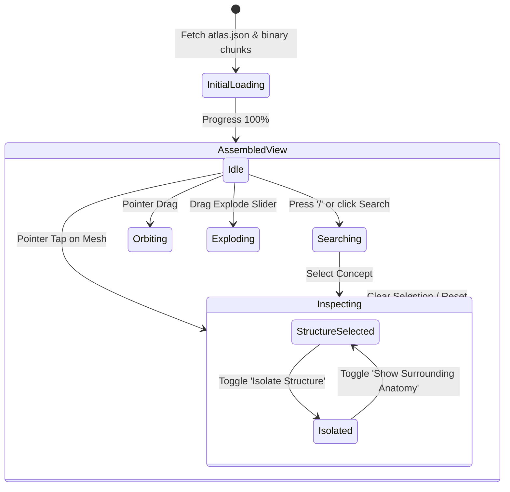

# Human Atlas Architecture & System Design

An in-depth technical analysis of the **Human Atlas (Anatomy Studio)** codebase, detailing its data pipeline, GPU rendering engine, spatial packing algorithms, application state, and WebMCP agent capabilities.

---

## 1. Executive Summary

**Human Atlas** is a high-performance, web-based 3D anatomy explorer built with **React 19**, **Three.js (r159)**, **Tailwind CSS v4**, and **Base UI / shadcn/ui**. It renders **2,234 individually selectable anatomical meshes** encompassing **2,288,268 triangles** and **3,432 named FMA concepts** derived from the **BodyParts3D 4.0** adult male reference model.

The core engineering feat of the project is achieving **60 FPS interactive rendering and responsive orbit controls** on mobile and desktop web browsers without suffering from the overhead of thousands of draw calls, massive network payloads, or heavy CPU-side scene-graph traversals.

### Key Architectural Highlights

| Subsystem | Core Technique | Architectural Benefit |
| :--- | :--- | :--- |
| **Draw Call Reduction** | Geometry Merging by System (`mergeGeometries`) | Reduces 2,234 potential draw calls down to ~15 draw calls (one per anatomical system). |
| **Part Animation & Visibility** | GPU Data Texture + Custom GLSL Vertex Shader | Updates position offsets `(dx, dy, dz)` and visibility flags on the GPU in a single texture upload per frame; zero geometry buffer mutations. |
| **Memory Quantization** | Int16 Normalized Normals (`Int16Array`, normalized: true) | Halves normal vector memory on GPU/RAM compared to standard Float32 normals while maintaining smooth lighting. |
| **Geometry Optimization** | Meshoptimizer Quadric Simplification (`meshoptimizer`) | Shrinks source geometry by ~78% within a strict 0.2% relative error bound per anatomical structure. |
| **Explosion Layout** | 2D Aspect-Aware Bin-Packing (`createExplosionLayout`) | Dynamically arranges all visible structures into a non-overlapping planar catalog adapted to the viewport aspect ratio. |
| **Hybrid Interaction** | BVH Bounding Box Pre-Check + Screen Space Target Proximity | Instant raycasting on complex meshes with smooth hover tooltips in exploded mode without lag. |
| **AI Agent Interface** | WebMCP (`navigator`/`document.modelContext`) | Exposes standardized `find_anatomy` and `inspect_anatomical_structure` tools to AI browsing agents. |

---

## 2. High-Level System Architecture



---

## 3. Directory & File Organization

```
human-atlas/
├── app/
│   ├── agent-tools.ts       # WebMCP integration for browser AI agents
│   ├── anatomy.ts           # Types, 15 anatomical systems, explanations, constants
│   ├── explosion-layout.ts  # Aspect-ratio-aware 2D bounding-box packing algorithm
│   ├── globals.css          # Tailwind CSS v4 design tokens, glassmorphism, responsive sheet styles
│   ├── model-download.ts    # DecompressionStream streaming fetch & byte-validation
│   ├── page.tsx             # Root UI state machine, search combobox, controls dock, drawer sheets
│   ├── pointer-tap.ts       # Robust multi-touch vs single-tap gesture disambiguation
│   └── scene.tsx            # Three.js WebGL engine, custom GLSL shaders, camera framing, raycasting
├── components/ui/           # Accessible UI primitives (@base-ui/react, shadcn, radix-style)
├── hooks/
│   └── use-mobile.ts        # MatchMedia hook for viewport breakpoint (768px)
├── lib/
│   └── utils.ts             # Tailwind classnames merge helper (clsx + tailwind-merge)
├── public/
│   ├── ATTRIBUTION.md       # Full licensing info (CC BY 4.0 BodyParts3D) and adaptation records
│   └── models/
│       ├── atlas.json       # Manifest containing all parts, concepts, bounds, and chunk manifests
│       ├── body-0.bin(.gz)  # Binary chunks containing interleaved vertex, normal, and index buffers
│       └── ...body-14.bin(.gz)
├── scripts/
│   ├── compress-models.mjs      # Node.js gzip compression script for binary chunks
│   ├── convert-anatomy.py       # Python pipeline translating OBJ to coordinate-corrected binary
│   ├── optimize-anatomy.mjs     # Meshoptimizer simplification with quadric decimation & vertex welding
│   ├── validate-atlas.mjs       # Assertions verifying 2,234 parts, 3,432 concepts, buffer integrity
│   └── validate-interactions.mjs# Headless tests for non-overlapping packing and tap recognition
├── web/
│   ├── index.html           # HTML entry point with meta viewport and typography
│   └── main.tsx             # React 19 createRoot mount point
├── package.json             # Build scripts and runtime dependencies
├── tsconfig.json            # Strict TypeScript compiler options
├── vercel.json              # Static hosting configuration
└── vite.config.ts           # Vite build pipeline with React & Tailwind CSS plugins
```

---

## 4. The Offline Data Pipeline

The anatomical models originate from **BodyParts3D 4.0 (TARO MRI reference)**. Rendering over 2,200 separate OBJ files directly in the browser would require hundreds of megabytes of downloads and choke standard WebGL engines. The repository implements an end-to-end compression and serialization pipeline:

```
[Raw BodyParts3D OBJ]
         │
         ▼  (scripts/convert-anatomy.py)
   1. Coordinate Conversion: mm -> meters, Z-up -> Y-up
   2. Normal Quantization: float -> signed int16 ([-32767, 32767])
   3. Chunking: Pack into 7MB uncompressed segments
   4. Manifest Generation: atlas.json with part offsets and FMA concept hierarchy
         │
         ▼  (scripts/optimize-anatomy.mjs)
   5. Vertex Welding & Normal Averaging
   6. MeshoptSimplifier: Quadric decimation with max 0.2% error threshold
   7. Re-indexing & Compaction: compactMesh strips unused vertices
         │
         ▼  (scripts/compress-models.mjs)
   8. Gzip Compression: Level 9 compression into .bin.gz
```

### Data Specifications
* **Coordinate Transformation**: 
  $$\begin{bmatrix} X_{scene} \\ Y_{scene} \\ Z_{scene} \end{bmatrix} = \begin{bmatrix} X_{obj} \cdot 0.001 \\ Z_{obj} \cdot 0.001 + 0.0781112 \\ -Y_{obj} \cdot 0.001 - 0.1 \end{bmatrix}$$
  This converts millimeters to meters, aligns the ground plane so the human model stands on the pedestal, and converts Z-up to Three.js standard Y-up.
* **Normal Compression**: Instead of three 32-bit floats (12 bytes per vertex), normals are quantized as three signed 16-bit integers (6 bytes per vertex, normalized via WebGL `gl.SHORT`).
* **Binary File Layout**: Within each `.bin` chunk, data is sequentially packed with 4-byte alignment:
  `[Vertex Positions (Float32)] -> [Normals (Int16)] -> [Triangle Indices (Uint32)]`

---

## 5. Runtime 3D Rendering Architecture (`app/scene.tsx`)

### 5.1 Single-Pass Batching by Anatomical System
If 2,234 parts were rendered as independent `THREE.Mesh` objects, Three.js would issue 2,234 draw calls every frame, generating severe CPU-GPU driver overhead.

Instead, during loading:
1. All geometry parts are downloaded across 3 parallel fetch streams.
2. An individual `THREE.BufferGeometry` is constructed for each part, and an attribute `partIndex` (a single float representing the part's index $i \in [0, 2233]$) is attached to every vertex.
3. Geometries belonging to each of the **15 anatomical systems** (Skeleton, Muscles, Arteries, Veins, Nervous, etc.) are merged into a single composite geometry using `BufferGeometryUtils.mergeGeometries(geometries, false)`.
4. This results in **only ~15 meshes added to the scene**, dramatically reducing WebGL draw calls from 2,234 down to 15.

### 5.2 GPU-Driven Transform & Selection Engine
Because the meshes are permanently merged, individual parts cannot be repositioned or hidden using standard Three.js object transforms (`mesh.position` or `mesh.visible`).

To solve this, the engine uses **GPU Data Textures** and **custom GLSL vertex/fragment shaders**:

1. **`partTexture` (Float32Array DataTexture, $N \times 1$)**:
   - `R, G, B`: Holds the translation delta vector $(dx, dy, dz)$ for structure $i$.
   - `A`: Holds visibility ($1.0 = \text{visible}, 0.0 = \text{hidden}$).
2. **`selectionTexture` (Uint8Array DataTexture, $N \times 1$)**:
   - `R`: Selection intensity ($255 = \text{selected}, 0 = \text{unselected}$).
3. **GLSL Shader Injection (`material.onBeforeCompile`)**:
   - **Vertex Shader**: Looks up `partTexture` using the vertex's `partIndex` attribute:
     ```glsl
     vec2 stateUv = vec2((partIndex + 0.5) / stateWidth, 0.5);
     vec4 state = texture2D(partState, stateUv);
     transformed += state.xyz; // Apply dynamic displacement (explosion / isolation)
     partVisible = state.w;
     partSelected = texture2D(selectionState, stateUv).r;
     ```
   - **Fragment Shader**: Discards invisible parts without geometry rebuilds and blends selection highlight:
     ```glsl
     if (partVisible < 0.5) discard;
     diffuseColor.rgb = mix(diffuseColor.rgb, vec3(0.42, 0.85, 0.78), partSelected * 0.75);
     ```

### 5.3 Explosion Layout & 2-Phase Animation
The explosion mechanism (`app/explosion-layout.ts` and `app/scene.tsx`) transitions the model between three distinct visual states:

```
Assembled (0%) ──[Phase 1: Radial Expansion]──► Separated (45%) ──[Phase 2: Planar Grid Packing]──► Exploded Catalog (100%)
```

1. **Phase 1 ($0\% \le t \le 45\%$)**: Structures separate radially based on their system group angle $\theta_{sys} = \frac{systemIndex}{totalSystems} \cdot 2\pi$ and vertical distance from the torso center.
2. **Phase 2 ($45\% < t \le 100\%$)**: Structures lerp smoothly from their 3D radial positions to a 2D planar inventory grid arranged in front of the camera ($Z = 0$).
3. **Packing Algorithm (`createExplosionLayout`)**:
   - Computes 2D bounding boxes for all currently visible parts.
   - Calculates total surface area and derives a target packing width based on viewport aspect ratio:
     $$\text{targetWidth} = \max(\text{maxWidth}, \sqrt{\text{totalArea} \cdot \text{aspect}} \cdot 1.18)$$
   - Sorts parts by height descending and packs them in row-major order with spacing.
   - Centers the layout horizontally and vertically.
   - Ensures zero overlap between exploded parts regardless of mobile or desktop screen dimensions.

### 5.4 High-Performance Picking & Raycasting
When 2,234 parts are merged, native raycasting on the merged mesh would only identify the whole system mesh, not the specific organ or bone.

The engine uses a multi-tier hybrid picking pipeline:
1. **Lightweight Picker Meshes**: The application retains individual unmerged geometries in memory with `matrixAutoUpdate = false`.
2. **Bounding Box Pre-Filtering**: When the user taps, the raycaster first tests the ray against each part's translated axis-aligned bounding box (`worldBox.copy(bounds[i]).translate(mesh.position)`).
3. **Ray-Triangle Intersection**: Only if the bounding box intersects the ray does Three.js perform exact triangle testing on that individual part.
4. **Projected Screen-Space Hit Testing (Exploded Mode)**: When pieces are laid out flat in exploded mode, an array of 2D screen-projected targets (`Target { index, x, y, left, right, top, bottom }`) is computed during rendering. Moving the cursor or tapping directly performs a 2D distance test, enabling instant hover card tooltips without expensive 3D raycasting per frame.

---

## 6. UI & Application State Machine (`app/page.tsx`)

The application state is centralized in `app/page.tsx` and passes downward:



### State Fields (`SceneState`)
* `explode: number` (0.0 to 1.0): Continuous explosion progress.
* `visible: SystemId[]`: Active systems among the 15 anatomical categories.
* `selected: string[]`: IDs of currently selected parts (`FJ...`).
* `isolate: boolean`: When true, dims/hides everything except the selected structure and frames it in the camera.
* `view: 'three-quarter' | 'front' | 'side' | 'back'`: Camera angle presets.
* `rotate: boolean`: Ambient auto-rotation toggle (disabled during explosion or isolation).
* `reset: number`: Monotonic counter used to trigger camera recentering.
* `inspectorOpen: boolean`: Synchronized with detail drawer opening/closing to adjust camera view offsets dynamically.

### Interaction Disambiguation (`app/pointer-tap.ts`)
A dedicated state tracker (`PointerTap`) handles pointer events:
* Distinguishes intentional clicks/taps from camera orbit drags by enforcing pixel travel thresholds (5px for mouse, 12px for touch).
* Blocks selection if multi-touch gestures (pinch-to-zoom, two-finger pan) are detected.
* Ensures accidental drag gestures never trigger unexpected part selection.

### Dynamic View Offsets (`camera.setViewOffset`)
When inspecting a structure on mobile or desktop, the structure must not be obscured by the floating slide-out drawer (`.detail-sheet`).
Instead of awkwardly moving the 3D target, the engine calculates the unobstructed viewport rectangle (`availableWidth`, `availableHeight`) and applies an asymmetric camera projection offset:
```typescript
camera.setViewOffset(w, h, w/2 - (left + right)/2, h/2 - (top + bottom)/2, w, h);
```
This mathematically centers the anatomical organ inside the visible screen clearance.

---

## 7. WebMCP AI Agent Interface (`app/agent-tools.ts`)

Human Atlas integrates with **WebMCP** (`window.modelContext` / `document.modelContext`), enabling browser-integrated AI agents (e.g., Gemini in Chrome) to explore the human body programmatically:

### Registered Tools
1. **`find_anatomy`**:
   - **Type**: Read-only query tool.
   - **Schema**: `{ query: string }`.
   - **Behavior**: Searches all 3,432 FMA concepts and part IDs for name or identifier matches, returning up to 30 matched structures with their element counts.
2. **`inspect_anatomical_structure`**:
   - **Type**: Interactive command tool.
   - **Schema**: `{ id: string }` (FMA ID or part ID).
   - **Behavior**: Programmatically selects the concept, isolates or frames it in the 3D viewport, and opens the detail inspector panel synchronously via `flushSync`.

---

## 8. Quality Assurance & Validation Pipeline

The codebase includes automated validation scripts in `scripts/`:

1. **Atlas Integrity Verification (`scripts/validate-atlas.mjs`)**:
   - Asserts exact counts: **2,234 parts**, **3,432 concepts**, **2,288,268 triangles**.
   - Validates that every part references a valid concept and system.
   - Verifies that binary buffer offsets (`positions`, `normals`, `indices`) do not exceed file bounds.
   - Asserts index buffer vertex indices never exceed `vertexCount`.
2. **Interaction & Packing Verification (`scripts/validate-interactions.mjs`)**:
   - Simulates aspect ratios (`0.46` mobile portrait, `1.0` square, `1.7` desktop widescreen).
   - Checks that `createExplosionLayout` produces **zero overlapping bounding boxes** across all system permutations.
   - Validates `PointerTap` state transitions under single-tap, multi-touch pinch, drag, and cancellation.
   - Validates search and inspect contracts for AI agent tools.

---

## 9. Performance & Technical Metrics

| Metric | Measured Value | Architectural Reason |
| :--- | :--- | :--- |
| **Total 3D Meshes** | 2,234 parts | Full BodyParts3D 4.0 reference anatomy coverage. |
| **Triangle Count** | 2,288,268 triangles | Decimated with MeshoptSimplifier at 0.2% maximum relative error. |
| **Total Download Size** | ~33 MB (gzip) | 15 binary chunks compressed with gzip level 9. |
| **Draw Calls Per Frame** | 15 - 19 | Geometry merged by system; ground rings and markers add 4 calls. |
| **Texture GPU Memory** | ~36 KB | $2048 \times 1$ Float32 data texture + $2048 \times 1$ Uint8 selection texture. |
| **Target Frame Rate** | 60 FPS | Dirty-flag render loop: renders only on camera movement or state lerp. |
| **Mobile Adaptability** | $\le 320\text{px}$ to $4\text{K}+$ | Responsive layout packing, touch thresholds, and camera view offsetting. |
