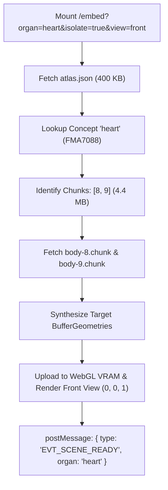

# PRD-01: Human Atlas 3D Embed Engine & Selective Streaming

* **Document ID**: `PRD-01`
* **Status**: Ready for Implementation
* **Component**: `human-atlas` (WebGL Engine & Embed Host)
* **Target Audience**: 3D Graphics Engineers, WebGL Developers, Performance Engineers

---

## 1. Objective & Scope

Transform the standalone Human Atlas web application into an embeddable, headless, and low-latency 3D micro-frontend. The engine must support rendering single organs in isolation within $\le 1.2\text{s}$, consume $\le 4.5\text{ MB}$ of data for common organs, and gracefully coexist with host chat applications without GPU crashes.

---

## 2. Embed Route & URL Parameter Specification

A dedicated route `/embed` (or query mode on `/`) will initialize a streamlined viewer instance stripped of heavy desktop application chrome (no layers panel, search bar, or long attribution footers).

### 2.1 URL Query Parameter Schema

```
https://atlas.studyai.com/embed?organ=heart&isolate=true&view=front&theme=dark&controls=compact&autopause=true&dpr=1.5&embed=true&mini=false
```

| Parameter | Type | Default | Description |
| :--- | :--- | :--- | :--- |
| `organ` / `concept` | `string` | `null` | Organ common name (e.g., `heart`, `brain`, `femur`, `liver`) or exact FMA identifier (`FMA7088`). |
| `isolate` | `boolean` | `true` | When `true`, strictly hides non-target structures and locks downloading to target organ chunks only. |
| `view` | `string` | `'front'` | Initial camera orientation preset: `'front'` (Standard Anatomical Front View `(0, 0, 1)` - default), `'back'`, `'side'`, or `'three-quarter'`. |
| `embed` | `boolean` | `false` | When `true`, strips desktop application chrome (header, search bar, attribution footer) for embedding. |
| `mini` | `boolean` | `false` | When `true`, activates ultra-compact card styling with minimal controls. |
| `highlight` | `string` | `null` | Comma-separated list of sub-structures to highlight in cyan/gold (e.g., `mitral valve,left ventricle`). |
| `theme` | `string` | `'light'` | Color scheme: `'dark'` (`#0f172a` canvas, light typography) or `'light'` (`#f8fafc` canvas). |
| `controls` | `string` | `'compact'` | UI control density: `'compact'` (floating pill with reset & inspector buttons), `'none'` (pure canvas), or `'full'`. |
| `rotate` | `boolean` | `false` | Enables subtle, ambient auto-rotation ($0.5\text{ rad/s}$) when idle. |
| `autopause` | `boolean` | `true` | Automatically halts the `requestAnimationFrame` loop when the iframe is off-screen. |
| `dpr` | `number` | `1.5` | Maximum device pixel ratio cap (prevents thermal throttling on $3\times$ Retina mobile screens). |

---

## 3. Selective Chunk Streaming Engine & Strict Isolate Lockdown

### 3.1 The Problem
Previously, `app/scene.tsx` downloaded all 15 binary chunks (`body-0.chunk` to `body-14.chunk`) totaling **31.4 MB compressed (60 MB raw)** before rendering. For an embedded view of the heart or femur, downloading 31.4 MB consumes excessive mobile bandwidth and triggers iOS Safari Jetsam memory process kills.

### 3.2 Inverted Index Resolution Algorithm
Every part in `atlas.json` records its chunk container:
```json
{
  "id": "FJ2841",
  "name": "Left ventricle",
  "conceptId": "FMA7088",
  "chunk": 8,
  "positions": 14200,
  "normals": 22400,
  "indices": 28600
}
```

#### Client Streaming Workflow:
1. Fetch `atlas.json` (~400 KB gzip) immediately.
2. Resolve target concept (e.g., `heart` $\to$ `FMA7088` $\to 83\text{ parts}$).
3. Compute required chunk index set:
   $$\text{RequiredChunks} = \bigcup_{p \in \text{ConceptParts}} \{ p.\text{chunk} \}$$
   * E.g., for **Heart**: $\text{RequiredChunks} = \{8, 9\}$ (~4.4 MB total download).
   * E.g., for **Femur**: $\text{RequiredChunks} = \{0\}$ (~2.2 MB total download).
4. Fetch **only** the required `.chunk` files concurrently via `Promise.all`.
5. Construct Three.js `BufferGeometry` exclusively for the active parts.
6. Display dynamic progress text: e.g. `"Loading 83 Human Heart pieces"` (avoiding generic or misleading "Loading 2,234 pieces").
7. Assemble system batch meshes and dispatch `EVT_SCENE_READY` event to the parent host.



### 3.3 Strict Isolate Mode Lockdown (Payload & Memory Guard)
In production testing, allowing users to toggle from an isolated organ to the full body within an embed iframe caused catastrophic background downloading of the remaining 13 chunks (27 MB+), freezing cellular connections and overloading WebGL VRAM.

**Architectural Decision**:
* **Complete Removal of Full-Body Escape**: The "Show body" / "Isolated" toggle button is removed from embed controls, and the "Show surrounding anatomy" button is removed from the part inspector sheet.
* **Chunk Firewall**: `app/scene.tsx` enforces a strict guard: when `state.isolate` or `priorityChunks` is active, background loading of non-target chunks is completely disabled.
* **Front View Reset Guard**: Clicking "Reset camera" or "Front view" in organ mode re-centers the camera strictly on the organ's bounding box from Front View `(0, 0, 1)`, and preserves `isolate: true` without resetting to the full body.

---

## 4. WebGL Lifecycle, Memory & Resilient UI Components

### 4.1 Base UI Error #27 Elimination & Resilient Drawer
During part inspection testing, clicking on anatomical structures or landmark pins triggered an uncaught exception:
`Base UI error #27: Dialog parts must be placed within <Dialog.Root>`.
* **Root Cause**: Bundling `@base-ui/react` with dual ESM/CJS packages generated duplicate context instances (`DialogRootContext`). `DialogBackdrop` looked up one instance while `DialogRoot` provided another. In React 19, this uncaught render error unmounted the component tree and froze the WebGL canvas.
* **Solution**: Replaced `@base-ui/react/dialog` with a standalone, zero-dependency accessible React drawer component (`components/ui/sheet.tsx`). Part clicking and landmark navigation now execute smoothly with 0 uncaught errors.

### 4.2 Strict Disposal Cascade
When an iframe unmounts, Three.js does not automatically release GPU VRAM. The embed engine must execute an explicit, synchronous tear-down protocol:

```typescript
export function disposeEmbedEngine(ctx: ViewerContext) {
  // 1. Cancel active render loop
  cancelAnimationFrame(ctx.frameId);
  ctx.intersectionObserver.disconnect();
  ctx.resizeObserver.disconnect();
  ctx.controls.dispose();

  // 2. Dispose GPU textures
  ctx.partTexture.dispose();
  ctx.selectionTexture.dispose();
  ctx.environmentTexture.dispose();

  // 3. Dispose geometries and release CPU arrays
  ctx.geometries.forEach(geom => {
    Object.values(geom.attributes).forEach(attr => {
      if ('array' in attr) (attr as any).array = null;
    });
    geom.dispose();
  });

  // 4. Dispose materials & shaders
  ctx.materials.forEach(mat => mat.dispose());

  // 5. Force GPU driver context loss
  const gl = ctx.renderer.getContext();
  const loseExt = gl.getExtension('WEBGL_lose_context');
  if (loseExt) loseExt.loseContext();

  ctx.renderer.dispose();
  ctx.renderer.domElement.remove();
}
```

### 4.3 WebGL Context Loss Recovery
To survive device sleep, tab switching, or GPU driver crashes:
```typescript
renderer.domElement.addEventListener('webglcontextlost', (e) => {
  e.preventDefault();
  cancelAnimationFrame(frameId);
  window.parent.postMessage({ type: 'CONTEXT_LOST' }, '*');
});

renderer.domElement.addEventListener('webglcontextrestored', async () => {
  await reinitializeScene();
  window.parent.postMessage({ type: 'CONTEXT_RESTORED' }, '*');
});
```

---

## 5. Viewport Adaptation, Camera Framing & DPI

### 5.1 Mobile Retina DPI Clamping
Rendering high-density meshes at native $3\times$ DPR on mobile devices causes rapid GPU thermal throttling.
* **Desktop ($>768\text{px}$)**: Clamp to $\min(\text{DPR}, 2.0)$.
* **Mobile ($\le 768\text{px}$)**: Clamp to $\min(\text{DPR}, 1.5)$.

### 5.2 Dynamic Bounding Box Framing
When an organ is isolated, the camera must frame it automatically:
1. Compute the tight Axis-Aligned Bounding Box (AABB) of all selected parts:
   $$\text{AABB}_{\text{organ}} = \bigcup_{p \in \text{Parts}} \text{Box3}(p.\text{bounds})$$
2. Determine bounding sphere radius $R$ and center point $C$.
3. Compute required camera distance:
   $$D = \frac{R}{\sin(\text{FOV} / 2)} \cdot 1.25$$
4. Smoothly slerp camera position to $C + \vec{v}_{\text{view}} \cdot D$ and orbit target to $C$.

---

## 6. Bi-Directional PostMessage API (Typed RPC)

Communication between the Study AI host and the embedded iframe follows a strictly typed, versioned event contract.

### 6.1 Parent $\to$ Iframe (Commands)
```typescript
export type EmbedCommand =
  | { type: 'CMD_FOCUS_ORGAN'; payload: { organ: string; isolate?: boolean } }
  | { type: 'CMD_HIGHLIGHT_PARTS'; payload: { names: string[] } }
  | { type: 'CMD_SET_VIEW'; payload: { view: 'front' | 'back' | 'side' | 'three-quarter' } }
  | { type: 'CMD_TOGGLE_ISOLATE'; payload: { isolate: boolean } }
  | { type: 'CMD_SET_EXPLODE'; payload: { amount: number } }
  | { type: 'CMD_PAUSE_RENDER' }
  | { type: 'CMD_RESUME_RENDER' };
```

### 6.2 Iframe $\to$ Parent (Telemetry & Events)
```typescript
export type EmbedEvent =
  | { type: 'EVT_READY'; payload: { organ: string; partsCount: number; triangles: number } }
  | { type: 'EVT_PROGRESS'; payload: { percent: number; loadedBytes: number } }
  | { type: 'EVT_PART_CLICKED'; payload: { partId: string; name: string; conceptId: string; system: string } }
  | { type: 'EVT_CAMERA_CHANGE'; payload: { azimuth: number; altitude: number; distance: number } }
  | { type: 'EVT_ERROR'; payload: { message: string; code: 'NETWORK_FAIL' | 'WebGL_FAIL' | 'NOT_FOUND' } };
```

### 6.3 Security Enforcement
* The iframe must inspect `event.origin` against an allowed origin whitelist (`ALLOWED_STUDY_AI_HOSTS`).
* The iframe will never execute arbitrary `eval` or dynamic script injection via messages.

---

## 7. Acceptance Criteria & Test Plan

1. **Selective Chunk Latency**: Loading `heart` on a simulated 4G connection loads $\le 5\text{ MB}$ data and renders in $<2.0\text{s}$.
2. **Context Cleanup**: Mounting and unmounting the iframe 20 consecutive times results in zero net increase in WebGL active contexts (verified via `performance.memory` and DevTools memory snapshot).
3. **Orbit & Touch Reliability**: Mobile pinch-zoom and rotation operate at 60 FPS without jitter.
4. **FMA Resolution Accuracy**: Querying `mitral valve` correctly highlights part `FJ2841` inside the heart model.
