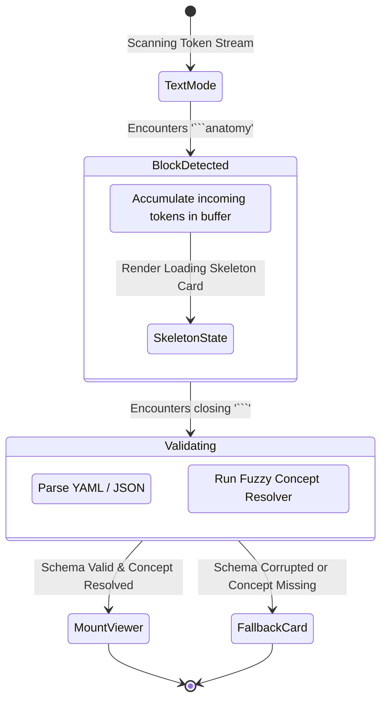
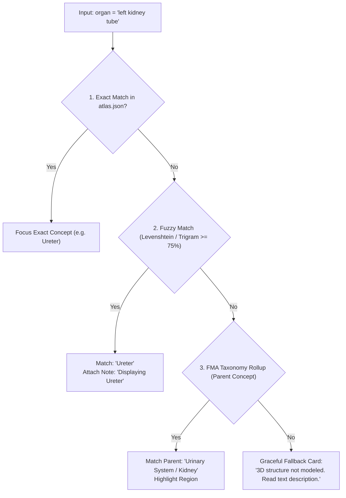

# PRD-02: AI Tutor Syntax, Streaming Parser & Prompt Engineering

* **Document ID**: `PRD-02`
* **Status**: Ready for Implementation
* **Component**: Study AI LLM Integration, Prompt Pipeline & Client Parser
* **Target Audience**: AI Engineers, Prompt Engineers, Full-Stack Developers

---

## 1. Objective & Scope

Define the standard conversational syntax (DSL), prompt engineering guidelines, streaming token parser state machine, and hallucination prevention system that allows any Large Language Model (e.g., Gemini, Claude, GPT-4) to emit interactive 3D anatomical structures without UI glitches or parsing errors during real-time token streaming.

---

## 2. Syntax Grammar & Design

### 2.1 The Markdown Code Block DSL (`anatomy`)
The AI model outputs 3D requests using a standardized fenced code block. Both single-organ and multi-organ slider/carousel structures are supported.

#### Pattern A: Single Organ Inspection
````markdown
```anatomy
organ: heart
isolate: true
view: front
highlight: ["mitral valve", "left ventricle"]
autoRotate: false
caption: "Anterior view of the heart isolating left-side flow structures."
```
````

#### Pattern B: Multi-Organ Comparative Slider / Carousel
When discussing a system or comparative anatomy (e.g., cardiopulmonary, digestive, or skeletal), the AI emits an `items` array to render an interactive horizontal slider inside the chat bubble:
````markdown
```anatomy
view: front
items:
  - organ: heart
    caption: "Muscular pump (83 pieces)"
    highlight: ["mitral valve"]
  - organ: trachea
    caption: "Cartilaginous airway (32 pieces)"
  - organ: lungs
    caption: "Gas exchange parenchyma"
```
````

### 2.2 Schema Definition (Single & Multi-Organ Dual Support)

```typescript
export interface AnatomyItemPayload {
  /** Target organ name or FMA identifier (e.g. 'heart', 'femur', 'FMA7088') */
  organ: string;
  /** Sub-structures or elements to highlight */
  highlight?: string[];
  /** Educational subtitle displayed on the card footer */
  caption?: string;
  /** Estimated piece count or custom badge */
  partsCount?: number;
}

export interface AnatomyDSLPayload {
  /** Single organ shortcut (Pattern A) */
  organ?: string;
  /** Multi-organ carousel items (Pattern B) */
  items?: AnatomyItemPayload[];
  /** Whether to isolate the organ or show it with surrounding anatomy (default: true) */
  isolate?: boolean;
  /** Initial camera angle preset: default strictly 'front' */
  view?: 'front' | 'back' | 'side' | 'three-quarter';
  /** Sub-structures or elements to highlight (single organ) */
  highlight?: string[];
  /** Continuous gentle rotation (default: false) */
  autoRotate?: boolean;
  /** Educational subtitle displayed on the card footer */
  caption?: string;
  /** Exploded view intensity (0.0 to 1.0) */
  explode?: number;
}
```

---

## 3. Streaming Token Parser State Machine

### 3.1 The Streaming Challenge
During real-time Server-Sent Events (SSE) streaming, the LLM emits tokens character-by-character:
```
Token 1: "Here"
Token 2: " is the"
Token 3: " heart:\n```anat"
Token 4: "omy\norgan: he"
Token 5: "art\nisolate: tr"
Token 6: "ue\n```"
```
* **Failure Mode**: If the client attempts to parse on every token, JSON/YAML parsers throw syntax errors, and React will mount/unmount the 3D canvas 30 times per second, crashing the WebGL driver.

### 3.2 State Machine Specification



### 3.3 Reference Implementation: Client Streaming Parser
```typescript
export type StreamingParserState = 
  | { status: 'idle' }
  | { status: 'streaming'; partialBuffer: string }
  | { status: 'ready'; payload: AnatomyDSLPayload }
  | { status: 'error'; rawContent: string; message: string };

export class AnatomyStreamParser {
  private buffer = '';
  private inBlock = false;

  public processChunk(textToken: string): StreamingParserState {
    this.buffer += textToken;

    const blockStart = this.buffer.indexOf('```anatomy');
    if (blockStart === -1) {
      return { status: 'idle' };
    }

    const contentAfterStart = this.buffer.slice(blockStart + '```anatomy'.length);
    const blockEnd = contentAfterStart.indexOf('```');

    if (blockEnd === -1) {
      // Code block is still actively streaming from LLM
      this.inBlock = true;
      return { status: 'streaming', partialBuffer: contentAfterStart };
    }

    // Block is fully closed!
    const rawPayload = contentAfterStart.slice(0, blockEnd).trim();
    try {
      const payload = this.parsePayload(rawPayload);
      return { status: 'ready', payload };
    } catch (err: any) {
      return { status: 'error', rawContent: rawPayload, message: err.message };
    }
  }

  private parsePayload(raw: string): AnatomyDSLPayload {
    // Attempt JSON parse first
    if (raw.startsWith('{')) {
      return JSON.parse(raw);
    }
    // Fallback simple YAML key-value parser
    const lines = raw.split('\n');
    const result: any = {};
    for (const line of lines) {
      const [key, ...rest] = line.split(':');
      if (!key || rest.length === 0) continue;
      const k = key.trim();
      let v: any = rest.join(':').trim();
      if (v === 'true') {
        v = true;
      } else if (v === 'false') {
        v = false;
      } else if (typeof v === 'string' && v.startsWith('[') && v.endsWith(']')) {
        v = JSON.parse(v);
      }
      result[k] = v;
    }
    if (!result.organ) throw new Error("Missing required field: 'organ'");
    return result as AnatomyDSLPayload;
  }
}
```

---

## 4. Hallucination Prevention & Fuzzy Concept Reconciliation

### 4.1 The Hallucination Edge Case
LLMs frequently output informal anatomical names, non-existent FMA IDs, or terms not modeled in the reference geometry:
* Example: `"fmaId": "FMA_99999"` (Non-existent ID)
* Example: `"organ": "solar plexus"` (Nerve plexus not modeled as distinct mesh)
* Example: `"organ": "heart pipe"` (Informal slang)

### 4.2 Three-Tier Fuzzy Concept Reconciliation Pipeline



#### Pre-Compiled Alias Dictionary:
To ensure 100% resolution for student queries, a static alias map must be bundled in the client:
```typescript
export const COMMON_ANATOMICAL_ALIASES: Record<string, string> = {
  'heart': 'Heart',
  'brain': 'Brain',
  'voicebox': 'Larynx',
  'windpipe': 'Trachea',
  'throat': 'Pharynx',
  'collarbone': 'Clavicle',
  'thigh bone': 'Femur',
  'kneecap': 'Patella',
  'shinbone': 'Tibia',
  'mitral valve': 'Mitral valve',
  'aortic valve': 'Aortic valve',
  'belly': 'Stomach',
  'liver': 'Liver',
  'kidney': 'Kidney'
};
```

---

## 5. System Prompt Engineering & Templates

### 5.1 System Prompt Instruction for Study AI
Inject the following instructions into the AI tutor's system prompt:

```text
You are an expert AI medical and anatomy tutor. You have access to an interactive 3D anatomical viewer powered by BodyParts3D.

When the student asks about an organ, bone, muscle, or body system—or whenever visualizing spatial relationships would aid their learning—include a 3D visualization using the ```anatomy``` code block.

RULES:
1. Always output valid markdown text FIRST, explaining the physiological concept.
2. Place the ```anatomy block AFTER your textual explanation.
3. Use canonical anatomical terminology for the 'organ' parameter (e.g., 'Heart', 'Femur', 'Liver', 'Trachea').
4. If the student asks about a specific feature (like a valve or ventricle), specify the parent organ in 'organ' and the specific sub-part in 'highlight'.
5. Always set 'isolate: true' to ensure fast sub-second loading without downloading non-target body chunks.
6. The default camera view is strictly 'front' (standard anatomical position).
7. When the student asks about a system, comparative physiology, or multiple organs, use the 'items' array to generate an interactive multi-organ slider.

SYNTAX TEMPLATES:

Single Organ:
```anatomy
organ: <Organ Name>
isolate: true
view: front
highlight: ["<sub-part-1>", "<sub-part-2>"]
caption: "<Educational 1-sentence description>"
```

Multi-Organ Slider:
```anatomy
view: front
items:
  - organ: <Organ 1>
    caption: "<1-line description>"
  - organ: <Organ 2>
    caption: "<1-line description>"
```
```

### 5.2 Few-Shot Conversation Examples

#### Example 1: Isolating a Specific Organ
* **Student**: *"Can you show me the kidneys and explain what they do?"*
* **AI Output**:
  ```markdown
  The kidneys are paired retroperitoneal organs that filter metabolic waste products from the blood and produce urine.

  ```anatomy
  organ: kidney
  isolate: true
  view: front
  caption: "Anterior view of the paired kidneys and renal vasculature."
  ```
  ```

#### Example 2: Highlighting Sub-Structures
* **Student**: *"Where is the hippocampus located?"*
* **AI Output**:
  ```markdown
  The hippocampus is a seahorse-shaped structure embedded deep within the temporal lobe, essential for the consolidation of short-term memory into long-term memory.

  ```anatomy
  organ: brain
  isolate: true
  view: front
  highlight: ["hippocampus"]
  caption: "Anterior brain view highlighting the hippocampus in the medial temporal lobe."
  ```
  ```

#### Example 3: Multi-Organ Slider (System Overview)
* **Student**: *"What are the primary organs involved in the cardiopulmonary circuit?"*
* **AI Output**:
  ```markdown
  The cardiopulmonary circuit coordinates gas exchange and circulation. Deoxygenated blood is pumped from the heart through the pulmonary artery to the lungs, where the airway (trachea and bronchial tree) delivers oxygen.

  ```anatomy
  view: front
  items:
    - organ: heart
      caption: "Cardiovascular pump (83 pieces)"
      highlight: ["pulmonary trunk"]
    - organ: trachea
      caption: "Conducting cartilaginous airway (32 pieces)"
    - organ: lungs
      caption: "Gas exchange parenchyma"
  ```
  ```

---

## 6. Acceptance Criteria

1. **Streaming Stability**: Parsing 100 consecutive streaming tokens of an ```anatomy``` block produces zero console errors or DOM remounts until the block is fully closed.
2. **Schema Resiliency**: Minor syntax flaws (missing quotes in array, trailing commas) are parsed cleanly by the tolerant YAML/JSON parser.
3. **Fuzzy Match Accuracy**: Synonyms like "collarbone" and "windpipe" resolve accurately to "Clavicle" and "Trachea" with $\ge 99\%$ accuracy.
4. **Graceful Fallback**: Asking for a non-modeled entity (e.g., "red blood cell") renders an informative explanatory card without breaking chat flow.
