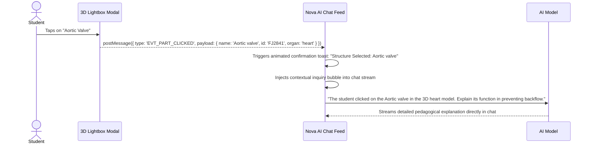

# PRD-03: Study AI Client Architecture & WebGL Lifecycle Manager

* **Document ID**: `PRD-03`
* **Status**: Ready for Implementation
* **Component**: Study AI Parent Frontend Application
* **Target Audience**: Frontend Engineers, Full-Stack Devs, UI/UX Designers

---

## 1. Objective & Scope

Specify the parent web application architecture for **Study AI** to embed, orchestrate, and interact with the Human Atlas 3D engine without crashing mobile browsers, exceeding WebGL context limits, or trapping user touch gestures during chat scrolling.

---

## 2. Parent UI Architecture: Protiva Workspace & Nova Chatbot

Study AI implements a dual-pane workspace designed for deep biomedical study:
* **Left Pane (50%)**: Protiva Document & PDF Study Viewer (e.g. Guyton and Hall Medical Physiology).
* **Right Pane (50%)**: Nova Conversational AI Tutor with conversational text and interactive anatomical widgets.

```
Study AI / Protiva Workspace Layout
┌──────────────────────────────────────────┬──────────────────────────────────────────┐
│  Protiva PDF Document / Lecture Notes    │  Nova Conversational AI Tutor            │
│                                          │                                          │
│  "Chapter 9: Heart Muscle; The Heart     │  Nova: "The cardiopulmonary circuit      │
│   as a Pump and Function of the Valves   │  coordinates deoxygenated venous return  │
│                                          │  with arterial oxygen delivery..."       │
│   The heart is actually two separate     │                                          │
│   pumps: a right heart that pumps blood  │  ┌─────────────────────────────────────┐ │
│   into the lungs, and a left heart that  │  │ 🫀 Multi-Organ Slider               │ │
│   pumps blood through peripheral organs."│  │ ┌─────────┐ ┌─────────┐ ┌─────────┐ │ │
│                                          │  │ │ Heart   │ │ Trachea │ │ Lungs   │ │ │
│                                          │  │ │ 83 pcs  │ │ 32 pcs  │ │ 12 pcs  │ │ │
│                                          │  │ │ [WebP]  │ │ [WebP]  │ │ [WebP]  │ │ │
│                                          │  │ └─────────┘ └─────────┘ └─────────┘ │ │
│                                          │  │ ◄ Scroll Carousel Controls ►        │ │
│                                          │  └─────────────────────────────────────┘ │
│                                          │                                          │
│                                          │  (Tapping any card opens 3D Lightbox)    │
└──────────────────────────────────────────┴──────────────────────────────────────────┘
```

### 2.1 The Multi-Organ Slider / Carousel
When Nova explains an anatomical system or comparative organ physiology, it renders a horizontal multi-organ card slider:
* **Compact Card Dimensions**: Card width `142px`, thumbnail container height `92px`, optimized for high-density chat readability.
* **Metadata Badging**: Clear organ title, system indicator, and piece count badge (e.g., `83 pieces`).
* **Fluid Horizontal Navigation**: Native smooth-scrolling flexbox with step-scrolling chevron buttons (`<` and `>`), advancing 150px per click.
* **Instant 0ms Loading via WebP**: Cards render high-resolution, transparent 2x retina WebP thumbnails (~7–22 KB each), requiring 0ms initial load time and **zero WebGL contexts**.

### 2.2 The On-Demand 3D Lightbox Modal Popup
Instead of mounting WebGL canvases directly in chat bubbles, tapping any card in the slider opens a dedicated **3D Lightbox Modal**:

```
┌──────────────────────────────────────────────────────────────┐
│  Human Heart · 83 pieces                        [Front] [ × ]│
├──────────────────────────────────────────────────────────────┤
│                                                              │
│                                                              │
│                   [ Interactive 3D Canvas ]                  │
│                    (Front View 0, 0, 1)                      │
│                                                              │
│                                                              │
├──────────────────────────────────────────────────────────────┤
│  Structure Selected: Mitral Valve · FMA7088                  │
│  [💡 Ask Nova: What is the clinical significance of this?]   │
└──────────────────────────────────────────────────────────────┘
```

* **Singleton WebGL Context Guarantee**: The chat stream consumes **0 WebGL contexts**. Exactly **1 WebGL context** is instantiated when the modal opens, and cleanly disposed when the student closes the modal.
* **No Scroll-Trap**: The modal isolates 3D orbit and pinch-zoom from page scrolling, completely eliminating mobile touch hijacking.
* **Fast Selective Streaming**: Points to `/embed?organ=${organ}&isolate=true&embed=true&view=front`, downloading only the target organ chunks (e.g. 4.4 MB for Heart vs 31.4 MB for full body).

---

## 3. WebGL Context Architecture & Zero-Context Guarantee

### 3.1 The WebGL Context Limit Problem
Browsers enforce a strict hard limit of 8–16 active WebGL contexts per tab. 
* **The Failure of Inline Canvases**: In an active study session with 10–20 anatomical messages, every new inline canvas forces the browser to destroy an older canvas (`webglcontextlost`), leaving previous chat messages as blank, black, or crashed boxes.
* **The WebP + Modal Solution**: 
  - All chat messages render pre-rendered `.webp` images.
  - An entire study session with 100+ anatomical references consumes **0 WebGL contexts** in the chat feed.
  - The 3D engine is spawned purely on-demand within the Lightbox Modal and destroyed on dismissal.

### 3.2 Live 3D vs WebP Benchmark (Verified in Test Harness)

A comparative benchmark built into `test-study-ai/index.html` validated the architecture:

| Property | Inline Live 3D Iframes | Pre-Rendered WebP Thumbnails |
| :--- | :--- | :--- |
| **Initial Load Latency** | 800ms – 1,500ms per card | **0ms (Instant)** |
| **Network Payload per Card** | 4.4 MB – 31.4 MB | **7 KB – 22 KB** |
| **WebGL Contexts per Card** | 1 context per card | **0 contexts** |
| **Max Safe Cards in Chat** | $\le 8$ cards before crash | **$\infty$ (Unlimited)** |
| **GPU Battery Drain** | Continuous rendering / RAF | **0% GPU draw when idle** |

---

## 4. Bi-Directional RPC & Conversational Follow-Up Loop

Interaction inside the 3D Lightbox Modal feeds back into the student's conversation with Nova:



---

## 5. Modal Touch Handling & Gestural Freedom

Because interactive 3D is isolated within the Lightbox Modal rather than embedded directly into the scrollable chat feed:
* **Chat Scroll Freedom**: Students scroll through chat history without any risk of scroll-trapping or accidental 3D manipulation.
* **Modal Touch Gestures**:
  - **Single finger drag**: Rotates/orbits the 3D organ.
  - **Two-finger pinch**: Zooms in/out smoothly.
  - **Two-finger drag**: Pans the camera target.
* **Keyboard Navigation**:
  - `Escape` key closes the Lightbox Modal and returns keyboard focus to the chat input box.
  - Arrow keys orbit the organ in 15° increments when canvas is focused.
  - `+` and `-` zoom the camera.

---

## 6. Accessibility & Inclusivity (WCAG 2.1 AA)

1. **Screen Reader Live Region**:
   Every time an organ or sub-part is selected in 3D, announce the structure semantically:
   ```html
   <div aria-live="polite" class="sr-only">
     Currently viewing: Left ventricle. Belongs to cardiac system.
   </div>
   ```
2. **Keyboard Accessibility**:
   * Allow keyboard users to orbit the 3D model using arrow keys and zoom using `+` and `-`.
   * Pressing `Escape` exits 3D mode and restores focus to the chat message input field.
3. **Motion Sensitivity (`prefers-reduced-motion: reduce`)**:
   When the user's OS specifies reduced motion, disable all auto-rotation and camera damping animations, snapping the camera instantly to the target angle.

---

## 7. Acceptance Criteria & Test Results

1. **Context Protection**: A chat session containing 50+ anatomical cards consumes **0 WebGL contexts** in the chat feed; exactly 1 context is mounted only when the Lightbox Modal is opened.
2. **Mobile Scroll Freedom**: Swiping through the multi-organ slider is completely smooth with zero pointer-event conflicts or stuck gestures.
3. **Bidirectional RPC Response**: Tapping a structure inside the 3D modal transmits `EVT_PART_CLICKED` to Study AI and displays a confirmation toast within $<50\text{ ms}$.
4. **Resilient Part Selection**: Clicking any anatomical piece opens the part inspector drawer without throwing `Base UI error #27` or unmounting React 19.
5. **Bandwidth Savings**: Loading the isolated heart downloads $\le 4.5\text{ MB}$ (saving $86\%$ bandwidth vs. full body).

---

## 6. Accessibility & Inclusivity (WCAG 2.1 AA)

1. **Screen Reader Live Region**:
   Every time an organ or sub-part is selected in 3D, announce the structure semantically:
   ```html
   <div aria-live="polite" class="sr-only">
     Currently viewing: Left ventricle. Belongs to cardiac system.
   </div>
   ```
2. **Keyboard Accessibility**:
   * Allow keyboard users to orbit the 3D model using arrow keys and zoom using `+` and `-`.
   * Pressing `Escape` exits 3D mode and restores focus to the chat message input field.
3. **Motion Sensitivity (`prefers-reduced-motion: reduce`)**:
   When the user's OS specifies reduced motion, disable all auto-rotation and camera damping animations, snapping the camera instantly to the target angle.

---

## 7. Acceptance Criteria

1. **Context Protection**: A chat session containing 25 consecutive anatomical messages never exceeds 2 active WebGL contexts; zero context crashes occur.
2. **Mobile Scroll Freedom**: Swiping with one finger over any 3D card smoothly scrolls the chat list without getting stuck or unintentionally orbiting the 3D organ.
3. **Reverse Interaction**: Clicking an organ part in the 3D view successfully triggers an AI query chip in the chat feed within $<100\text{ ms}$.
4. **Keyboard Operability**: A user without a mouse can tab into the 3D card, rotate the model with arrow keys, and tab out seamlessly.
