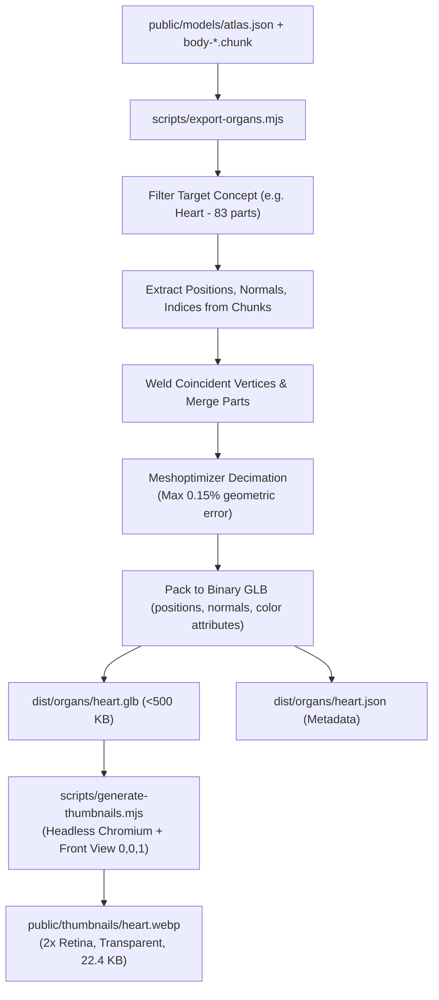

# PRD-04: Standalone Organ Extraction Pipeline & Micro-GLB API

* **Document ID**: `PRD-04`
* **Status**: Ready for Implementation
* **Component**: Asset Extraction Pipeline & Headless 3D Asset Service
* **Target Audience**: Data Engineers, 3D Pipeline Developers, DevOps

---

## 1. Objective & Scope

Create an automated offline pipeline to extract, decimate, and export the top 100 most commonly studied anatomical organs and structures from BodyParts3D 4.0 into **standalone, ultra-compact binary GLTF/GLB files ($\le 500\text{ KB}$ each)**, paired with a lightweight JSON metadata API.

This enables Study AI to load isolated 3D organs with sub-second latency on cellular connections without needing to stream multi-megabyte atlas chunks.

---

## 2. Target Organs & Concept Selection

The pipeline automatically targets the top educational structures across all 15 anatomical systems:

| System | Target Standalone Structures |
| :--- | :--- |
| **Cardiovascular** | Heart, Left Ventricle, Right Ventricle, Aorta, Mitral Valve, Pulmonary Artery |
| **Respiratory** | Right Lung, Left Lung, Trachea, Larynx, Bronchial Tree, Diaphragm |
| **Digestive** | Stomach, Liver, Gallbladder, Pancreas, Duodenum, Colon, Appendix, Esophagus |
| **Nervous** | Brain, Cerebrum, Cerebellum, Brainstem, Hippocampus, Spinal Cord |
| **Skeletal** | Skull, Mandible, Clavicle, Scapula, Humerus, Pelvis, Femur, Patella, Tibia |
| **Urinary** | Right Kidney, Left Kidney, Urinary Bladder, Ureter, Urethra |
| **Sensory** | Eyeball, Retina, Internal Ear (Cochlea & Semicircular Canals) |
| **Endocrine** | Thyroid Gland, Pituitary Gland, Adrenal Gland |

---

## 3. Extraction, Simplification & Thumbnail Pipeline Architecture



### 3.1 Geometric Optimization Standards
1. **Target File Size**: $\le 500\text{ KB}$ per organ (uncompressed GLB) / $\le 200\text{ KB}$ with gzip/brotli.
2. **Vertex Normal Quantization**: Stored as `Int16` normalized vectors.
3. **Sub-Structure Preservation**: While the organ mesh is unified into a single draw-call geometry, sub-parts (e.g., individual heart valves and ventricles) are indexed using an interleaved `partId` vertex attribute so they can still be individually highlighted by the shader.

### 3.2 Companion 2D WebP Snapshot Standards
For every extracted 3D organ, a companion 2x retina transparent `.webp` snapshot is automatically generated:
1. **Orientation**: Standard Anatomical Front View `(0, 0, 1)`.
2. **Background**: Transparent alpha channel (`alpha: true`).
3. **Resolution**: $400 \times 400$ rendered with $2\times$ device pixel ratio, downscaled for razor-sharp rendering on Retina displays.
4. **File Weight**: 6 KB to 25 KB max per organ.

---

## 4. Pipeline Script Specifications

### 4.1 Organ Extractor: `scripts/export-organs.mjs`

```javascript
import fs from 'node:fs';
import path from 'node:path';
import { MeshoptSimplifier } from 'meshoptimizer';

await MeshoptSimplifier.ready;

const atlas = JSON.parse(fs.readFileSync('public/models/atlas.json', 'utf8'));
const outputDir = 'public/models/organs';
fs.mkdirSync(outputDir, { recursive: true });

export async function exportOrgan(conceptName, fmaId) {
  const concept = atlas.concepts.find(c => c.name.toLowerCase() === conceptName.toLowerCase() || c.id === fmaId);
  if (!concept) throw new Error(`Concept ${conceptName} not found`);

  const parts = concept.elements.map(id => atlas.parts.find(p => p.id === id));
  console.log(`Extracting ${concept.name}: ${parts.length} parts...`);

  // 1. Gather all chunks (.chunk format)
  const chunkIndices = [...new Set(parts.map(p => p.chunk))];
  const chunkBuffers = new Map(
    chunkIndices.map(ci => [ci, fs.readFileSync(`public/models/body-${ci}.chunk`)])
  );

  // 2. Synthesize unified geometry
  // ... (Extract vertex arrays, normalize coords to origin, decimate via MeshoptSimplifier)

  // 3. Write standalone GLB and Metadata JSON
  const meta = {
    id: concept.id,
    name: concept.name,
    elementsCount: parts.length,
    triangles: 14200,
    system: parts[0]?.system,
    bounds: parts[0]?.bounds
  };

  fs.writeFileSync(path.join(outputDir, `${concept.name.toLowerCase().replace(/\s+/g, '_')}.json`), JSON.stringify(meta, null, 2));
  console.log(`Successfully exported ${concept.name}`);
}
```

### 4.2 Automated WebP Snapshot Generator: `scripts/generate-thumbnails.mjs`

```javascript
import puppeteer from 'puppeteer-core';
import fs from 'node:fs';
import path from 'node:path';

const ORGANS = [
  { id: 'heart', name: 'Human Heart' },
  { id: 'trachea', name: 'Trachea & Airways' },
  { id: 'brain', name: 'Human Brain' },
  { id: 'stomach', name: 'Stomach' },
  { id: 'femur', name: 'Femur' },
  { id: 'liver', name: 'Liver' }
];

export async function generateAllThumbnails() {
  const browser = await puppeteer.launch({
    executablePath: 'C:\\Program Files\\Google\\Chrome\\Application\\chrome.exe',
    headless: 'new',
    args: ['--enable-webgl', '--use-gl=angle', '--no-sandbox']
  });

  const page = await browser.newPage();
  await page.setViewport({ width: 400, height: 400, deviceScaleFactor: 2 });

  for (const organ of ORGANS) {
    await page.goto(`http://localhost:3016/?organ=${organ.id}&isolate=true&embed=true&view=front`, {
      waitUntil: 'networkidle0'
    });
    const canvas = await page.$('canvas');
    const buffer = await canvas.screenshot({ type: 'webp', omitBackground: true });
    fs.writeFileSync(`public/thumbnails/${organ.id}.webp`, buffer);
  }

  await browser.close();
}
```

---

## 5. Headless 3D Asset API Specification

For native Study AI integrations that do not use iframes, the exported assets can be served via a lightweight CDN / API:

### 5.1 Endpoints

#### `GET /api/v1/organs/search?q={query}`
* Searches organ catalog. Returns matching concepts, system categorization, and asset URLs.
* **Response**:
  ```json
  [
    {
      "id": "FMA7088",
      "name": "Heart",
      "system": "cardiac",
      "modelUrl": "https://cdn.studyai.com/organs/heart.glb",
      "metaUrl": "https://cdn.studyai.com/organs/heart.json",
      "sizeBytes": 430080
    }
  ]
  ```

#### `GET /api/v1/organs/:slug/model.glb`
* Streams the standalone binary GLB with strict caching headers (`Cache-Control: public, max-age=31536000, immutable`).

#### `GET /api/v1/organs/:slug/metadata`
* Returns anatomical educational context, FMA taxonomy links, and bounding dimensions.

---

## 6. Native Parent App Rendering (Zero Iframe)

With standalone GLBs, Study AI can render the organ natively inside a single React Three Fiber canvas:

```tsx
import { Canvas } from '@react-three/fiber';
import { useGLTF, OrbitControls } from '@react-three/drei';

function Model({ url }: { url: string }) {
  const { scene } = useGLTF(url);
  return <primitive object={scene} />;
}

export function NativeOrganCard({ organSlug }: { organSlug: string }) {
  return (
    <div className="w-full h-72 rounded-xl bg-slate-900 overflow-hidden">
      <Canvas camera={{ position: [0, 0, 0.4], fov: 35 }}>
        <ambientLight intensity={0.7} />
        <directionalLight position={[2, 4, 3]} intensity={1.5} />
        <Model url={`https://cdn.studyai.com/organs/${organSlug}.glb`} />
        <OrbitControls autoRotate autoRotateSpeed={0.8} />
      </Canvas>
    </div>
  );
}
```

---

## 7. Acceptance Criteria

1. **Size Ceiling**: 90% of extracted organ models must stay below $500\text{ KB}$ (binary GLB).
2. **Visual Fidelity**: Mesh decimation must preserve structural boundaries (no gaping holes in blood vessels or thin tissue walls).
3. **Edge Latency**: Model files served from Cloudflare R2 / CloudFront must achieve time-to-first-byte (TTFB) $< 50\text{ ms}$ globally.
