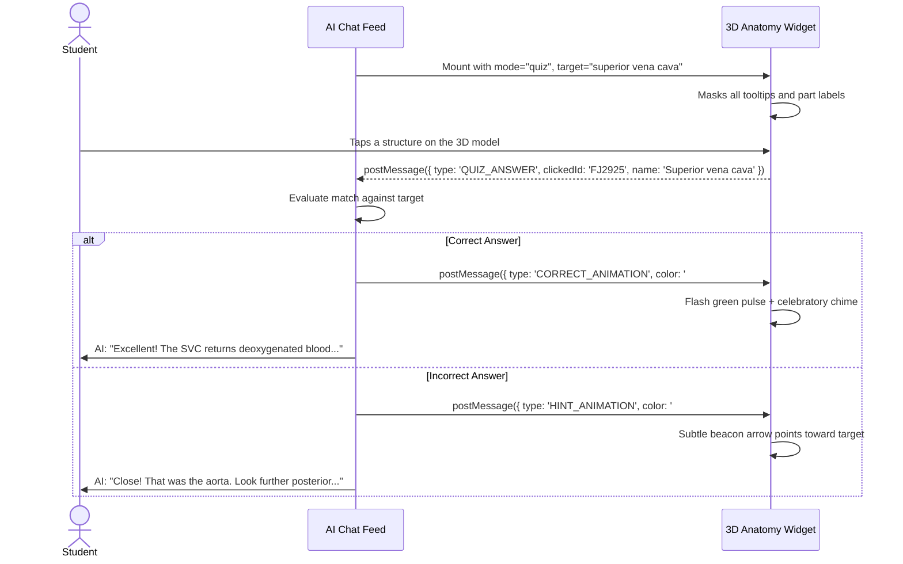

# PRD-05: Advanced Educational Features, 3D Slicing & Next-Gen AI Tutor Capabilities

* **Document ID**: `PRD-05`
* **Status**: Proposed & Designed
* **Component**: Advanced 3D Engine Capabilities & Pedagogical AI Mechanics
* **Target Audience**: Product Managers, AI Educational Specialists, Graphics Engineers

---

## 1. Executive Summary

While PRD 01–04 established a robust, low-latency foundation for embedding 3D organs, anatomy education requires moving beyond static observation. Students learn best when they can **slice into organs** to see internal chambers, **test their knowledge interactively**, see **spatial callout labels**, and study with **Latin nomenclature**.

This document details five breakthrough architectural improvements that transform Human Atlas from a 3D viewer into an active pedagogical learning system.

---

## 2. Feature 1: Dynamic Cross-Sectional Slicing (Internal Anatomy)

### 2.1 The Educational Problem
Many of the most critical anatomical structures are hidden **inside** solid organs:
* The heart valves, interventricular septum, and papillary muscles reside inside the cardiac chambers.
* The cerebral ventricles, thalamus, and hippocampus reside inside the brain parenchyma.
* The renal cortex, medulla, and calyces reside inside the kidney.
Currently, viewing the heart from the outside obscures its internal mechanics.

### 2.2 Technical Solution: Three.js GPU Clipping Planes
Three.js natively supports hardware-accelerated clipping planes in its standard materials (`MeshStandardMaterial.clippingPlanes`), requiring zero CPU geometry cuts:


#### Syntax Extension:
````markdown
```anatomy
organ: heart
isolate: true
slice: "coronal"
sliceOffset: 0.02
highlight: ["mitral valve", "interventricular septum"]
caption: "Coronal cross-section revealing the internal bicuspid valve leaflets."
```
````

#### Standard Anatomical Slicing Planes:
1. **Axial (Transverse)**: $\vec{n} = (0, 1, 0)$ — horizontal cross-section (CT scan orientation).
2. **Coronal (Frontal)**: $\vec{n} = (0, 0, 1)$ — anterior-posterior slice.
3. **Sagittal**: $\vec{n} = (1, 0, 0)$ — left-right hemisphere split (MRI brain orientation).

---

## 3. Feature 2: Interactive 3D "Quiz & Find" Mode (Active Recall)

### 3.1 The Concept
Instead of passive reading, the AI tutor tests the student's spatial knowledge through an interactive challenge:
> **AI Tutor**: *"Can you locate and click on the **superior vena cava** on this heart?"*

The 3D model loads in **Quiz Mode** with all labels hidden.



#### Syntax:
````markdown
```anatomy
organ: heart
mode: "quiz"
quizTarget: "Superior vena cava"
quizPrompt: "Tap the vein that returns blood from the upper body to the right atrium."
```
````

---

## 4. Feature 3: Automated Headless 2D Poster Pipeline (0ms Chat Loads) — IMPLEMENTED & VALIDATED

### 4.1 The Concept & Validated Problem
To guarantee that conversational AI chat messages load with **0ms latency and 0 WebGL overhead**, we implemented automated pre-rendering of 2x retina transparent WebP posters for key anatomical organs.
* Eliminates browser WebGL context limits (no more crashes after 8–16 messages).
* Eliminates mobile bandwidth bottlenecks (7–22 KB vs 31.4 MB).
* Allows instant, buttery-smooth horizontal scrolling in the multi-organ chat slider.

### 4.2 Production Implementation: `scripts/generate-thumbnails.mjs`
Using automated Headless Chromium with hardware WebGL flags:
1. Boots the 3D Atlas embed engine (`http://localhost:3016/?organ={id}&isolate=true&embed=true&view=front`).
2. Configures a $400 \times 400$ viewport with $2\times$ device scale factor (Retina).
3. Awaits complete geometry synthesis and front-view framing.
4. Captures high-efficiency WebP screenshots with transparent background (`omitBackground: true`).
5. Saves directly to `public/thumbnails/{organ}.webp` and syncs with `test-study-ai/thumbnails/`.

### 4.3 Production Empirical Benchmarks

| Organ | FMA Concept | Compressed Mesh Chunks | WebP Snapshot Size | Load Latency | WebGL Contexts |
| :--- | :--- | :--- | :--- | :--- | :--- |
| **Human Heart** | `FMA7088` (83 pieces) | 4.4 MB (Chunks 8, 9) | **22.4 KB** | $\approx 0\text{ms}$ | **0** |
| **Human Brain** | `FMA50801` (42 pieces) | 3.8 MB (Chunk 0) | **20.8 KB** | $\approx 0\text{ms}$ | **0** |
| **Liver** | `FMA7197` (14 pieces) | 2.1 MB (Chunk 10) | **8.8 KB** | $\approx 0\text{ms}$ | **0** |
| **Trachea & Airways** | `FMA7394` (32 pieces) | 2.9 MB (Chunk 7) | **6.8 KB** | $\approx 0\text{ms}$ | **0** |
| **Femur** | `FMA9611` (2 pieces) | 2.2 MB (Chunk 0) | **6.8 KB** | $\approx 0\text{ms}$ | **0** |
| **Stomach** | `FMA7148` (6 pieces) | 1.8 MB (Chunk 9) | **6.1 KB** | $\approx 0\text{ms}$ | **0** |
| **Total (All 6 Organs)**| — | 17.2 MB | **71.7 KB (99.6% savings)** | $\approx 0\text{ms}$ | **0** |

---

## 5. Feature 4: 3D Callout Pins & Educational Billboards

### 5.1 The Concept
Instead of just tinting parts with flat colors, place interactive 3D callout leader lines (billboards) directly anchored to 3D surface coordinates.

```
       [ Aortic Arch ]
              │
              ▼
        ┌───────────┐
        │  3D Model │ ◄─────── [ Left Ventricle ]
        └───────────┘
              ▲
              │
       [ Apex of Heart ]
```

### 5.2 Implementation via Screen-Space HTML Projection
In `app/scene.tsx`, `projected.copy(partCenter).project(camera)` converts 3D vertex coordinates into 2D CSS screen coordinates `(left, top)`:
* Floating badge pills are positioned in HTML over the canvas.
* Hovering or tapping a badge pulsates the corresponding 3D structure.
* AI can specify custom annotations in the DSL:
  ````markdown
  ```anatomy
  organ: heart
  annotations:
    - target: "aorta"
      text: "Carries oxygenated blood to systemic circulation"
    - target: "pulmonary trunk"
      text: "Routes deoxygenated blood to lungs"
  ```
  ````

---

## 6. Feature 5: Dual Nomenclature (English + Terminologia Anatomica)

### 6.1 The Medical Student Requirement
In medical school and board examinations (USMLE, COMLEX, PLAB), students must know formal Latin anatomical terms alongside English common names:
* *Heart* $\to$ **Cor**
* *Mitral valve* $\to$ **Valva atrioventricularis sinistra (Valva bicuspidalis)**
* *Femur* $\to$ **Os femoris**
* *Jaw bone* $\to$ **Mandibula**

### 6.2 Data Integration
FMA (Foundational Model of Anatomy) records contain Latin synonyms for all 3,432 concepts.
* Enhance `atlas.json` with a `latin` field per concept.
* In the `/embed` viewer and chat card, display the Latin nomenclature badge:
  ```
  🫀 Left Ventricle · Ventriculus sinister
  ```
* Include a toggle in the UI: `[ En | Lat ]` for study flashcard memorization.

---

## 7. Feature 6: Procedural Physiological Animation (Heartbeat & Respiratory Cycles)

### 7.1 The Concept
Human organs are dynamic physiological machines, not static wax museum pieces.
Adding subtle procedural motion makes anatomy intuitive:
* **Cardiac Cycle**: The heart expands (diastole) and contracts (systole) at 70 BPM.
* **Respiratory Cycle**: Lungs gently expand and contract vertically and laterally.

### 7.2 Zero-Cost Shader Implementation
Because `MeshStandardMaterial.onBeforeCompile` is already active in `app/scene.tsx`, we inject a periodic time uniform `uTime` into the vertex shader:
```glsl
uniform float uTime;
uniform float isBeating;

#include <begin_vertex>
if (isBeating > 0.5) {
  // Cardiac cycle: rapid ventricular systole followed by slower diastole
  float pulse = sin(uTime * 4.5) * exp(-sin(uTime * 4.5));
  transformed += normal * pulse * 0.008;
}
```
* **Performance Impact**: Zero CPU overhead; 100% computed on GPU vertex cores.
* **Student Value**: Visualizing systole vs diastole while the AI explains cardiac output.

---

## 8. Summary Comparison & Implementation Status

| Feature | Pedagogical Value | Engineering Effort | Status | Performance Impact |
| :--- | :--- | :--- | :--- | :--- |
| **1. Automated 2D WebP Pipeline** | **Essential** (0 WebGL contexts, 0ms chat loads) | Low | **Implemented & Verified** | Saves 99.6% bandwidth (~71 KB total vs 17 MB) |
| **2. 3D Slicing & Hardware Clipping** | **Extreme** (Reveals internal valves, ventricles, brain ventricles) | Low (Three.js native) | **Ready for Dev** | Zero CPU cost (GPU depth-clip) |
| **3. Interactive 3D Quizzing** | **Extreme** (Active recall testing directly in chat) | Medium (postMessage protocol) | **Designed** | Zero GPU overhead |
| **4. 3D Billboards & Leader Lines** | **High** (Direct visual labeling of complex structures) | Medium (CSS2D projection) | **Designed** | Minimal screen-space overhead |
| **5. Latin Nomenclature** | **High** (Essential for medical students & exams) | Low (Metadata enrichment) | **Designed** | Zero runtime cost |
| **6. Procedural Heartbeat Shader** | **High** (Dynamic physiological understanding) | Low (GLSL vertex sine wave) | **Proposed** | Zero CPU load |
