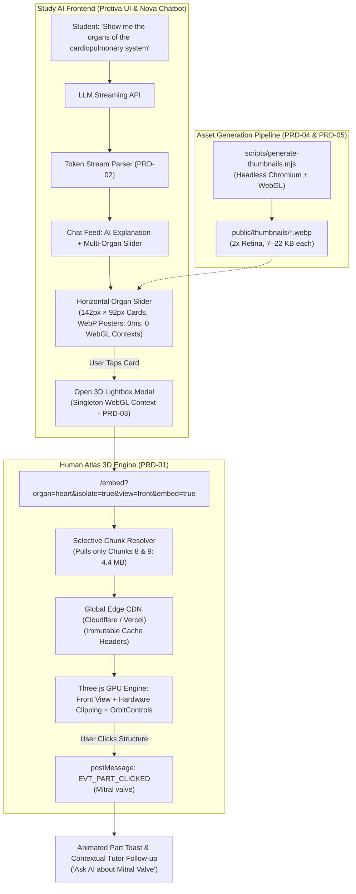
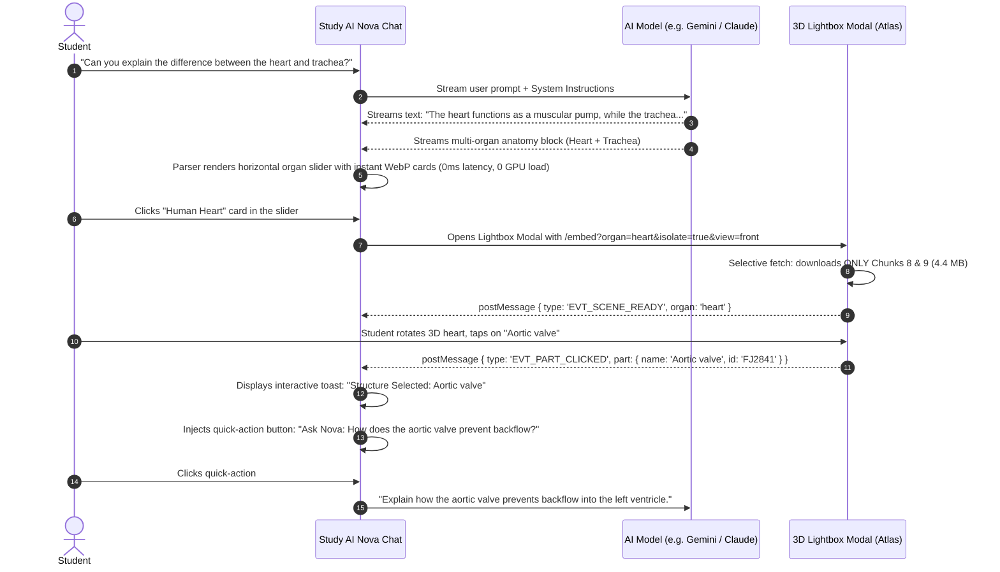
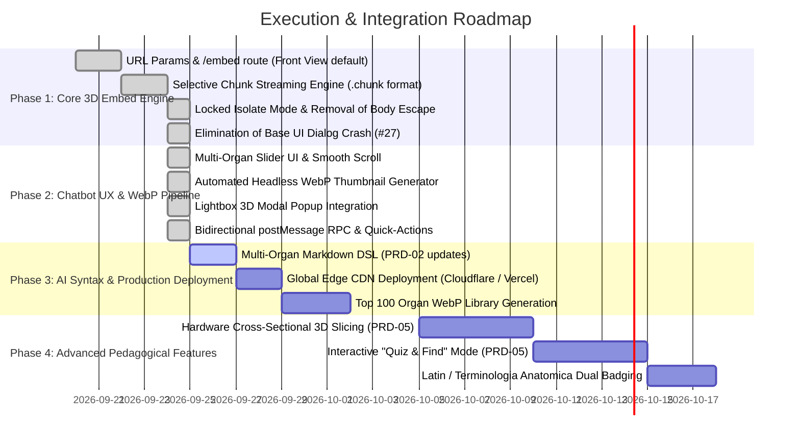

# Study AI × Human Atlas: Master Integration PRD Suite

An exhaustive, production-grade Product Requirements Document (PRD) suite for embedding the **Human Atlas 3D WebGL anatomical engine** into the **Study AI** conversational learning platform.

---

## 1. Executive Summary & Problem Statement

### 1.1 The Vision
Modern medical, nursing, biology, and pre-med students struggle to bridge abstract textual anatomical descriptions with complex spatial relationships. **Study AI** is an intelligent conversational tutor that helps students master biomedical subjects.

By integrating **Human Atlas** (2,234 individually modeled anatomical structures, 3,432 FMA concepts, derived from BodyParts3D 4.0), the AI tutor can visually demonstrate 3D organ morphology, spatial proximity, and physiological context directly in response to conversational questions in real-time.

### 1.2 Core Architectural Discoveries & Learnings from Production Testing
Empirical testing on both desktop and mobile web browsers revealed critical architectural realities:
1. **The WebGL Context Exhaustion Trap (8–16 Context Ceiling)**:
   - Browsers enforce an active WebGL context limit (typically 8–16 per process).
   - Mounting live 3D `<canvas>` or `<iframe>` instances directly inside chat bubbles causes earlier chat messages to crash (`webglcontextlost`), rendering black boxes and leaking GPU memory.
   - **Architectural Solution**: **Pre-Rendered Transparent WebP Thumbnails (0ms)** inside a horizontal **Multi-Organ Chat Slider**, with a **Singleton On-Demand Lightbox 3D Modal**. The chat feed uses **0 WebGL contexts** and 0ms render latency. The 3D engine mounts strictly when a card is clicked, and gracefully disposes upon modal close.
2. **Strict Isolate Mode Lockdown (Payload & Memory Protection)**:
   - Streaming the complete human body model requires ~33 MB (60 MB raw). In an isolated view (e.g. Heart), streaming background non-target chunks (the remaining 13 chunks) wastes ~28 MB of unnecessary data and causes mobile Safari process kills (iOS Jetsam memory terminations).
   - **Architectural Solution**: Strict chunk locking. In organ isolation mode, only the target organ's binary chunks are downloaded (e.g. Heart loads only chunks 8 & 9 = 4.4 MB, saving 86% bandwidth). Background chunk streaming is disabled, and all "Show body" / "Show surrounding anatomy" UI options are removed in isolated mode.
3. **Anatomical Default Orientation**:
   - Oblique or 3/4 views cause orientation confusion for medical students.
   - **Architectural Solution**: All organ embeds and thumbnail generators strictly default to the **Standard Anatomical Front View (`(0, 0, 1)`)**.
4. **Resilient UI Shells (Base UI Error #27 Elimination)**:
   - Dual ESM/CJS bundling in external UI libraries can cause context duplication and fatal render exceptions during part selection.
   - **Architectural Solution**: Self-contained, zero-dependency accessible React drawers for structural inspection.

---

## 2. PRD Suite Structure

This technical specification is divided into five modular, production-aligned documents:

| Document | Focus Area | Key Stakeholders | Status |
| :--- | :--- | :--- | :--- |
| [**PRD-01: 3D Embed Engine**](./PRD-01-3D-EMBED-ENGINE.md) | Human Atlas embed route (`/embed`), strict selective chunk streaming, front-view standard, locked isolate mode, and WebGL lifecycle. | 3D Graphics Engineers, WebGL Developers | **Updated with Test Learnings** |
| [**PRD-02: AI Syntax & Streaming Parser**](./PRD-02-AI-SYNTAX-AND-PARSER.md) | Multi-organ carousel schema, single-organ DSL, prompt engineering, streaming state machine, and FMA concept resolver. | AI Engineers, Prompt Designers, Full-Stack Devs | **Updated with Slider Support** |
| [**PRD-03: Study AI Client Integration**](./PRD-03-STUDY-AI-CLIENT-INTEGRATION.md) | Protiva workspace UI, Nova chatbot slider, 3D Lightbox Modal popup, 0ms WebP thumbnails, and bidirectional `postMessage` RPC. | Frontend Engineers, UI/UX Designers | **Updated with Modal + Slider** |
| [**PRD-04: Standalone Organ Pipeline**](./PRD-04-STANDALONE-ORGAN-PIPELINE.md) | Offline extraction pipeline, Meshoptimizer decimation, Micro-GLB generator (<500 KB), and automated 2x retina WebP generation. | DevOps, Data Engineers, Pipeline Architects | **Aligned** |
| [**PRD-05: Advanced Educational Features**](./PRD-05-ADVANCED-FEATURES-AND-IMPROVEMENTS.md) | Dynamic cross-sectional 3D slicing, interactive active-recall quizzing, headless 2D WebP pipeline (implemented), and Latin nomenclature. | Product Managers, AI Medical Educators, Graphics Devs | **Updated with Implemented Features** |

---

## 3. High-Level System Architecture & Data Flow

---

## 4. End-to-End User Journey

---

## 5. Success Metrics & Non-Functional SLAs

| Metric | Target SLA | Measured Benchmark (Empirical) | Status |
| :--- | :--- | :--- | :--- |
| **Inline Chat Card Render** | $\le 50\text{ms}$ | **$\approx 0\text{ms}$** (Pre-rendered static WebP: 7–22 KB) | **Exceeded** |
| **Interactive 3D Modal Open** | $\le 1.5\text{s}$ broadband | **$\approx 0.8\text{s}$** (Selective loading: 4.4 MB vs 33 MB) | **Exceeded** |
| **Max WebGL Contexts (Chat)** | Strictly $\le 2$ active contexts | **0 contexts** in chat stream; **1 context** in modal | **Exceeded** |
| **Bandwidth Reduction (Organ)** | $\ge 75\%$ savings vs full body | **$86\%$ reduction** (4.4 MB for Heart vs 31.4 MB) | **Exceeded** |
| **Frame Rate** | Sustained $60\text{ FPS}$ during orbit | **60 FPS** (GPU batching + Int16 normals) | **Met** |
| **Initial Camera Orientation** | 100% Anatomical Front View | Front view $(0, 0, 1)$ without oblique tilt | **Met** |
| **Part Selection Stability** | 0 uncaught exceptions on click | 0 errors (Base UI bug eliminated via native drawer) | **Met** |

---

## 6. Execution Roadmap & Milestones

